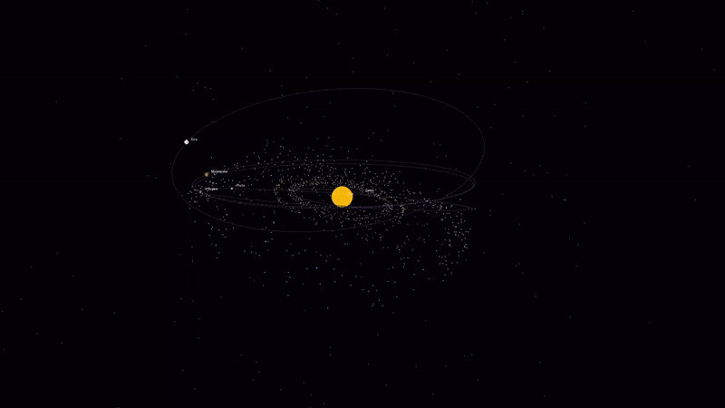

# Basic-3D

**Basic-3D** is a lightweight Python 3D engine built entirely from scratch, demonstrating the fundamentals of 3D graphics programming without any GPU or game-engine dependencies. It features a custom object-oriented math engine, real-time Keplerian orbital simulation, impostor sphere rendering, a first-person 6DOF camera, and a globally depth-sorted rendering pipeline — all running in real-time using Pygame.

## Demos

A spinning UV sphere rendered with the depth-sorted face pipeline:


The custom 3D text engine using greedy-meshed character geometry:


A parsed and rendered `.obj` penguin model alongside the text engine:


The real-time Keplerian minor solar system simulation (dwarf planets, asteroid belts, Trojans, comets, and the Oort Cloud):



## Features

- **Custom 3D Math Engine**: Built entirely on NumPy for fast matrix operations — translation, scaling, rotation across any axis, and perspective projection.
- **Topological Geometry**: Supports Points (nodes), Edges (wireframes), and Faces (solid polygons) as first-class rendering primitives.
- **Mathematical Mesh Generation**: Generates UV Spheres, cones, circles, impostor grids, and single-node objects procedurally.
- **Painter's Algorithm**: Globally depth-sorts all primitives (nodes, edges, faces) back-to-front across multiple objects each frame.
- **Perspective Projection**: Projects 3D coordinates onto a 2D plane using simulated focal length and camera orientation.
- **Impostor Spheres**: Renders vertices as flat matte circles that are perspective-scaled by depth, giving a convincing spherical appearance at near-zero geometry cost.
- **Unified Renderer**: A single `render_scene()` function handles multiple objects simultaneously, supporting per-object color overrides for faces, edges, and nodes independently.
- **6DOF First-Person Camera**: Full six-degrees-of-freedom camera with orientation-relative movement and local-axis pitch/yaw — movement and rotation always follow where you are looking.
- **Color Themes**: Five hand-crafted color themes (Neon Cyberpunk, Sunset Glow, Forest Mint, Lava/Inferno, Monochrome Slate) switchable at runtime.
- **Keplerian Orbital Simulation**: `solar-system.py` models dwarf planets, the Asteroid Belt, Jupiter Trojans, Centaurs, the Kuiper Belt, short- and long-period comets, and the Oort Cloud using Kepler's laws of orbital motion with proper inclination tilts.
- **Logarithmic Distance Scaling**: Fits the full solar system — from Ceres at 2.7 AU to the Oort Cloud at 8,000 AU — onto a single screen using a log₁₀ visual scale.
- **Unit Test Suite**: `tests/test_functions.py` covers all mathematical operations, projection logic, shape generators, JSON model loading, and rendering pipelines.

## File Overview

| File | Description |
|---|---|
| `functions.py` | Core engine: `Point`, `Obj`, `Camera` classes; `render_scene()`, `draw_impostor_sphere()`, `load_json_obj()` |
| `main.py` | Interactive showcase: 5 scenes, 5 themes, runtime toggles for faces/lines/nodes/impostor style |
| `solar-system.py` | Keplerian minor solar system simulation with dwarf planets, belts, comets, and Oort Cloud |
| `display.py` | General-purpose renderer for any `.json` 3D model file |
| `penger.py` | Penguin model + 3D text scene with per-object color overrides |
| `test_chars.py` | Full alphabet and digit showcase using the 3D font engine |
| `controls.py` | Shared keyboard input functions for movement and rotation |
| `char.py` | Converts characters to 3D `Obj` instances using the font atlas |
| `convert.py` | Converts `.obj` files to the engine's `.json` format |
| `tests/test_functions.py` | Unit tests for all core engine functions |
| `bench/benchmark.py` | Headless performance benchmarking script for math vs draw timings |

## Requirements

This project requires **Python 3** and the following libraries:

- **NumPy**: Vector and matrix arithmetic.
- **Pygame**: Real-time display, event handling, and drawing.
- **Pillow**: Offline image export via `Draw_To_Image`.

*(Note: If you are using NixOS, a `shell.nix` is provided that hooks up the required X11/Wayland/OpenGL native libraries for Pygame automatically.)*

## Installation & Execution

1. **Clone the repository**:
```bash
git clone https://github.com/yourusername/Basic-3D.git
cd Basic-3D
```

2. **Set up your environment**:
```bash
python3 -m venv venv
source venv/bin/activate
pip install numpy pygame pillow
```
*If you are on NixOS, simply run `nix-shell`.*

3. **Run the interactive showcase**:
```bash
python main.py
```

4. **Run the solar system simulation**:
```bash
python solar-system.py
```

5. **Render a custom `.json` model**:
```bash
python display.py penger.json
```

6. **Run the test suite**:
```bash
python -m unittest tests/test_functions.py
```

## Controls

All applications share a first-person 6DOF control scheme. Movement and rotation are always **relative to where you are currently looking**.

| Key | Action |
|---|---|
| `W` / `S` | Fly forward / backward |
| `A` / `D` | Strafe left / right |
| `Space` | Fly up (relative to view) |
| `Shift` | Fly down (relative to view) |
| `↑` / `↓` | Pitch up / down (relative to view) |
| `←` / `→` | Yaw left / right (relative to view) |
| `ESC` | Exit |

### `main.py` Additional Keys

| Key | Action |
|---|---|
| `O` | Cycle scenes (UV Sphere, Text, Penguin, Single Impostor, Impostor Grid) |
| `C` | Cycle color themes |
| `F` | Toggle face rendering |
| `L` | Toggle edge/line rendering |
| `N` | Toggle node rendering |
| `I` | Toggle node style (flat dot vs. impostor sphere) |

### `solar-system.py` Additional Keys

| Key | Action |
|---|---|
| `[` / `]` | Slow down / speed up simulation |
| `Space` | Pause / resume simulation |
| `-` / `=` | Zoom out / in |

## Performance & Benchmarks

The engine features an instrumented benchmark profiling the time spent on vector calculations (3D-to-2D projection, perspective scaling, and Painters depth sorting) vs the actual Pygame rendering draw calls on screen. 

Benchmarking yields the following results on active display window:

| Scene / Workload | Math & Sort Calc (ms) | Pygame Draw Call (ms) | Total Frame (ms) | Avg FPS | 10% Low FPS | 1% Low FPS |
| --- | --- | --- | --- | --- | --- | --- |
| UV Sphere (Faces + Edges + Nodes) | 2.964 | 5.779 | 8.744 | 114.4 | 84.3 | 82.8 |
| 3D Text Engine (Faces + Edges) | 3.918 | 5.480 | 9.398 | 106.4 | 105.3 | 94.1 |
| Solar System Mock (Orbits + 800 Nodes) | 4.936 | 2.364 | 7.299 | 137.0 | 132.6 | 124.0 |
| Penguin Showcase (penger.py Mock) | 6.414 | 10.371 | 16.785 | 59.6 | 58.8 | 56.3 |
| Character Test (test_chars.py - Demo Testing) | 4.536 | 7.095 | 11.632 | 86.0 | 84.0 | 81.2 |
| Font Generation Atlas (fontgen) | 12.614 | 0.000 | 12.614 | 79.3 | 79.3 | 79.3 |

To run the benchmark yourself:
```bash
python bench/benchmark.py
```

## Architecture

- **`functions.py`**: The engine core. `Point` handles per-vertex vector math. `Obj` manages vertex/edge/face topology, mesh generators, and 3D-to-2D projection. `Camera` stores world position and a 3×3 orientation matrix used for first-person 6DOF movement. `render_scene()` depth-sorts all primitives globally across multiple objects, supports per-object color overrides, and dispatches to either polygon, line, or impostor circle drawing.
- **`main.py`**: Application entry point. Handles multiple switchable scenes, theme cycling, and per-primitive render toggles.
- **`solar-system.py`**: Self-contained simulation. Each particle's position is computed each frame from Kepler's equation with full orbital inclination tilts. Debris fields (Asteroid Belt, Trojans, Kuiper Belt) orbit individually at Keplerian speeds. Comets use elliptical orbits solved iteratively via Newton's method on Kepler's equation.
- **`controls.py`**: Stateless keyboard polling functions consumed by all interactive scripts.
- **`tests/test_functions.py`**: Pure unit tests with no display dependency — uses an off-screen `pygame.Surface` for render path validation.
