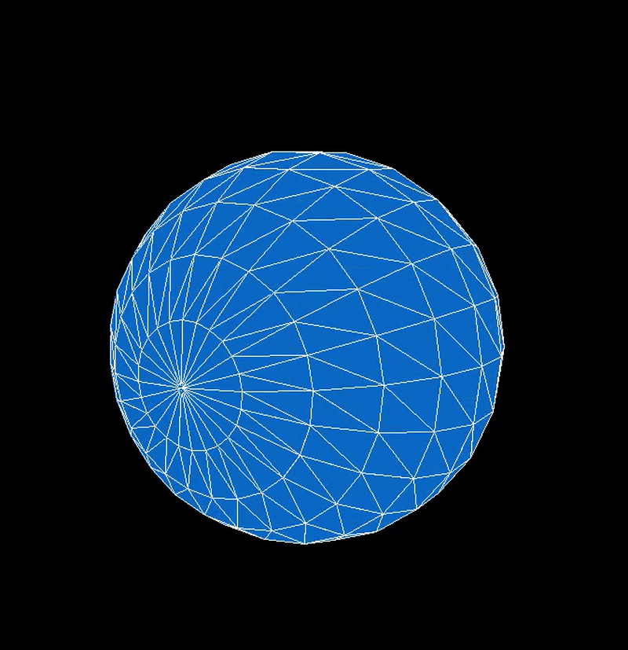
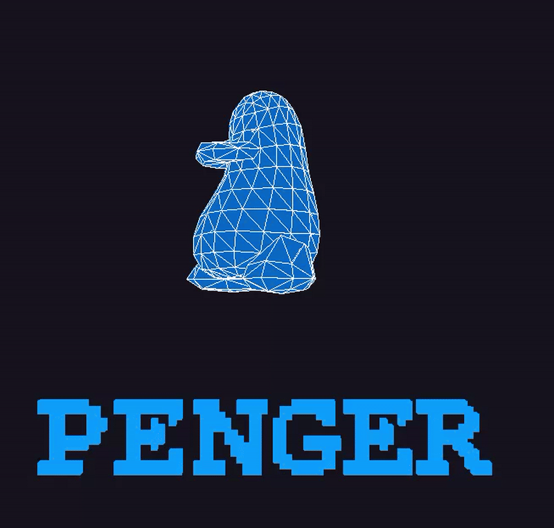

# Basic-3D

**Basic-3D** is a lightweight Python engine built from scratch to demonstrate the fundamentals of 3D graphics programming. It features a custom object-oriented 3D math engine that handles vector transformations, mathematically generated wireframes and faces, depth-sorting, and perspective projection—all rendered in real-time using Pygame.

## Demo

Here is a 5-second demo of the engine rendering a solid, depth-sorted spinning UV sphere in real-time:



And here is a 7-second demo of the custom 3D text engine rendering text using greedy meshing optimizations:


And here is a 10-second demo showcasing a custom parsed and rendered `.obj` model alongside the text engine:



## Features

- **Custom 3D Math Engine**: Built entirely on NumPy for fast matrix multiplications, allowing for translation, scaling, and rotation across any axis.
- **Topological Geometry**: Supports complex geometry including Points, Edges (wireframes), and Faces (solid polygons).
- **Mathematical Mesh Generation**: Generates mathematically perfect UV Spheres (using latitude and longitude loops) to avoid Z-fighting and geometry holes.
- **Painter's Algorithm**: Implements real-time depth sorting by calculating the average Z-depth of polygons in 3D space, ensuring faces are correctly drawn back-to-front.
- **Perspective Projection**: Projects 3D coordinates onto a 2D plane based on simulated focal length and camera positioning.
- **Real-Time Rendering**: Uses Pygame to render solid polygons with overlaid wireframes at 60 FPS in fullscreen.

## Requirements

This project requires **Python 3** and the following libraries:

- **NumPy**: Used for efficient matrix operations and vector arithmetic.
- **Pygame**: Used for real-time window management, event handling, and drawing polygons/lines.

*(Note: If you are using NixOS, a `shell.nix` is provided that automatically hooks up the necessary X11/Wayland/OpenGL libraries for Pygame).*

## Installation & Execution

1. **Clone the repository**:
```bash
git clone https://github.com/yourusername/Basic-3D.git
cd Basic-3D
```

2. **Set up your environment**:
If you are on standard Linux/MacOS/Windows, create a virtual environment and install the dependencies:
```bash
python3 -m venv venv
source venv/bin/activate
pip install numpy pygame pillow
```
*If you are on NixOS, simply run `nix-shell`.*

3. **Run the Engine**:
Start the real-time fullscreen demo:
```bash
python main.py
```
*Press `ESC` at any time to exit the fullscreen animation.*

## Architecture

- `functions.py`: Contains the `Point` and `Obj` classes. `Point` handles independent vector math, while `Obj` orchestrates collections of points, manages the topological arrays (`Edges` and `Faces`), and handles the camera projection algorithms.
- `main.py`: The application entry point. Initializes the Pygame display, sets up the camera, applies continuous rotation, calculates depth-sorting, and executes the drawing calls.
